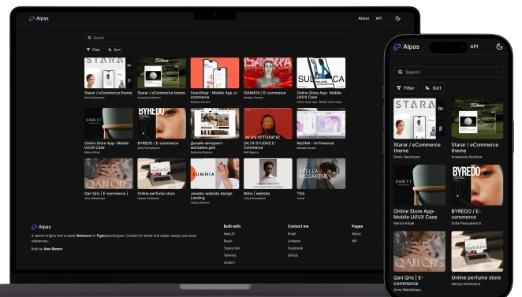

 

  

<h3 align="center">Alpas</h3>

  

    Search engine for Designs and Prototypes
     
    <a href="https://alpas.alecblance.com">View Demo</a>
    ·
    <a href="https://github.com/alecblance/alpas/issues">Report Bug</a>
    ·
    <a href="https://github.com/alecblance/alpas/issues">Request Feature</a>
  

<!-- ABOUT THE PROJECT -->

## About The Project

Stunning designs with good assets makes the developer and designer professional and skilled. Searching for these resources is difficult that is why I created Alpas. Alpas in Filipino is <i>"to break free"</i>. Alpas helps you search for Behance-uploaded designs with figma prototype for easier designing, web developing, and retrieving of assets.

### Built With

- NextJS
- React
- Typescript
- shadcn
- Behance GraphQL

<!-- CONTRIBUTING -->

## Contributing

Contributions are what make the open source community such an amazing place to learn, inspire, and create. Any contributions you make are **greatly appreciated**.

If you have a suggestion that would make this better, please fork the repo and create a pull request. You can also simply open an issue with the tag "enhancement".
Don't forget to give the project a star! Thanks again!

1. Fork the Project
2. Create your Feature Branch (`git checkout -b feature/AmazingFeature`)
3. Commit your Changes (`git commit -m 'Add some AmazingFeature'`)
4. Push to the Branch (`git push origin feature/AmazingFeature`)
5. Open a Pull Request

<!-- LICENSE -->

## License

Distributed under the MIT License. See `LICENSE.txt` for more information.

<!-- CONTACT -->

## Contact

Alec Blance - [Website](https://alecblance.com)

Project Link: [https://github.com/alecblance/alpas](https://github.com/alecblance/alpas)
